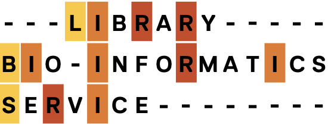
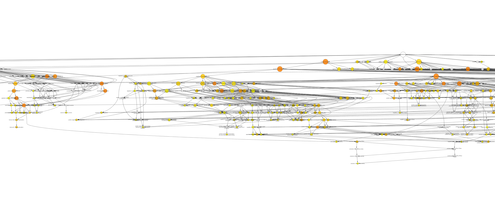
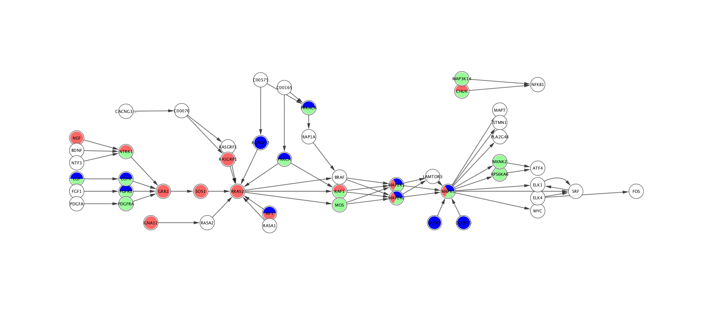

# Cytoscape for GO Enrichment and Visualization
## A tutorial on BiNGO, GOlorize and ClusterMaker2


```
Peter Oxley, PhD
Associate Director of Research Services

Weill Cornell Medicine
Information Technologies and Services
Samuel J. Wood Library & C.V. Starr Biomedical Information Center
1300 York Avenue Room D-120
New York, NY 10065-4896
(P) 646-962-2576
(F) 212-746-8364
 
pro2004@med.cornell.edu
```



## Setup for exercises
1) create the MAPK classic network from the tutorial on [network_construction](network_construction.md), exercises A through C.
2) go to App Manager and install "BiNGO", "GOlorize", and "ClusterMaker2".

## Exercise A) GO overrepresentation analysis with BiNGO
_The BiNGO user guide can be found [here](https://www.psb.ugent.be/cbd/papers/BiNGO/User_Guide.html)._

1) using cell formulae, re-assign the values of column "name" to equal that of "first-gene"
2) remove the style mapping for box fill in the style tab of the control panel
3) highlight the network/subnetwork you wish to analyze
4) select __BiNGO__ from the app menu
5) choose GO enrichment parameters. Ensure for this exercise that you select "get cluster from network", which will use the gene IDs from the "name" column, for all currently selected genes. Because you cannot select which column BiNGO will use for name mapping, you have to alter the content of the name column, as we did at step 66.

_BiNGO accesses annotation and ontology databases, that are not necessarily representative of the current release. However, if you download the appropriate files (see geneontology.org > Download > Annotations    and > Download > Ontologies), you can then point BiNGO to these files._

6) click on "Start BiNGO" in the BiNGO dialog window. This will create a new network, containing the GO hierarchy of all enriched terms. 

__View and modify the enriched GO hierarchy__

7) select the GO term network ("Bingo Cluster 1", unless you renamed it at step 71)

_All GO terms that were significanly enriched (after any multiple testing correction) are shown in yellow. The lower the P value, the more orange the node. Uncolored nodes are parent nodes needed to connect their enriched daughter nodes to the network. Node size is relative to the number of genes that are annotated with that GO term._

8) select all nodes 
9) select Layout > yFiles Layouts > Hierarchic
 

 
## Exercise B) Clustering of GO hierarchy

_This clustering exercise uses the Girvan-Newman algorithm to identify subnetworks within a network. This can help to describe the types of GO terms that have been assigned to your network._

1) ensure you are currently viewing the GO hierarchy network
2) select apps > clusterMaker > Community Cluster (GLay)
3) uncheck "Cluster only selected nodes"
4) check "Assume edges are undirected"
5) check "Create new clustered network"
6) uncheck "Restore inter-cluster edges after layout"
7) select the newly created network
8) select Layout > yFiles Layouts > Hierarchic

_Because the Gene Ontology terms are logically related, you can use the top-most GO term as a logical description of all the child nodes within a given cluster. When there is not a single node that is a common ancestor of all the nodes in the cluster, it is better to describe the cluster by all top-level nodes._ 

_Care should also be taken in naming the cluster which contains the topmost term (the GO major category of Biological Process, Molecular Mechanism or Cellular Location). Since this term logically describes all nodes in the GO hierarchy, it will be more informative to remove it from the analysis_

## Exercise C) Visualization of GO network using GOlorize
_A very helpful tutorial for GOlorize can be found [here](https://github.com/schwikowskilab/GOlorize/wiki)_. 
1) select __GOlorize__ from the app menu
2) select Start BiNGO
3) repeat the BiNGO analysis in Exercise A. When you run the analyis, it will also populate the results into GOlorize.
4) in the GOlorize options, choose the GO tab (labelled according to your entry in the BiNGO analysis: Default is Bingo cluster 1)
5) select the GO terms you wish to map onto your network
6) select "validate". If you wish to also select the genes on your network that contain these GO terms, click "Select nodes"
7) select the "Selected" tab
8) this window will show you all your selected GO terms. You can also add extra terms, which do not even need to be present in the GO analysis list (ie, perhaps you wish to see which genes are annotated with a particular term, even though it is not significantly enriched). To add GO terms, use the "Add GO category" button.
9) select "Auto-Colors" to color the nodes
10) click on any color in the list to bring up a color selector, so you can manually edit the colors.




## Bonus exercise:
_Using BiNGO, can you input the genes with significant differential expression, identify potential candidate pathways containing these genes (you can also use [KEGG mapper](http://www.kegg.jp/kegg/tool/map_pathway1.html) for this), then repeat the above exercise to color and sort the significant genes within the identified pathway?_ 

## Exercise C)  

 ## Answers/Hints to problems:
 hint for A3: "=$first_gene"
 
 