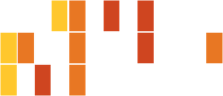

# Cytoscape for bioinformatics analysis and visualization

Based on two workshops originally given by Michael Bales, PhD and Peter Oxley, PhD for the Applied Bioinformatics Core [d:bug sessions](https://github.com/abcdbug/dbug) in March and April, 2017.

## Contents:
__Presentation Slides__
1. [An introduction to Cytoscape](./Bales_Network_Analysis_and_Cytoscape.pdf). Created by Michael Bales, PhD. 
2. [Using cytoscape for bioinformatics](./Oxley_demo_results_slides.pdf). Created by Peter Oxley, PhD.

__Tutorials__
3. [Creating basic networks in Cytoscape](./Bales_handout_Cytoscape.pdf).
4. [Using Cytoscape for network construction and visualization](./network_construction.md). 
5. [Using Cytoscape for Gene Ontology over-representation](./GO_enrichment.md). 

