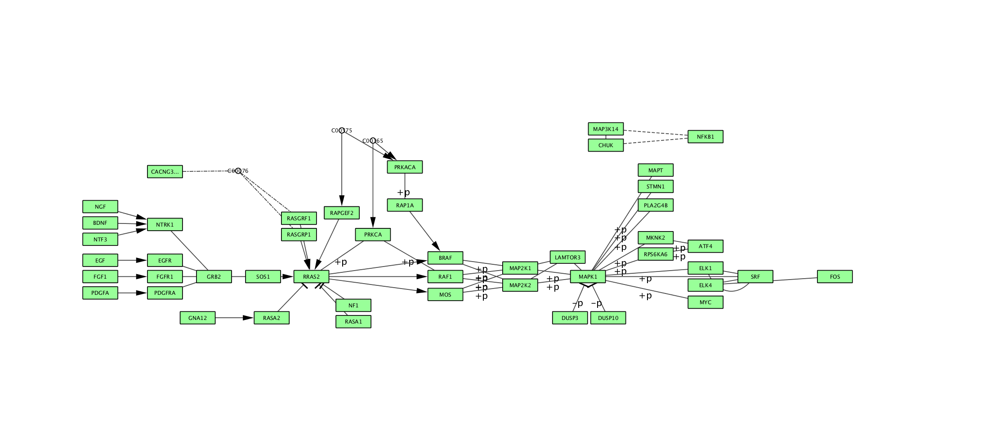
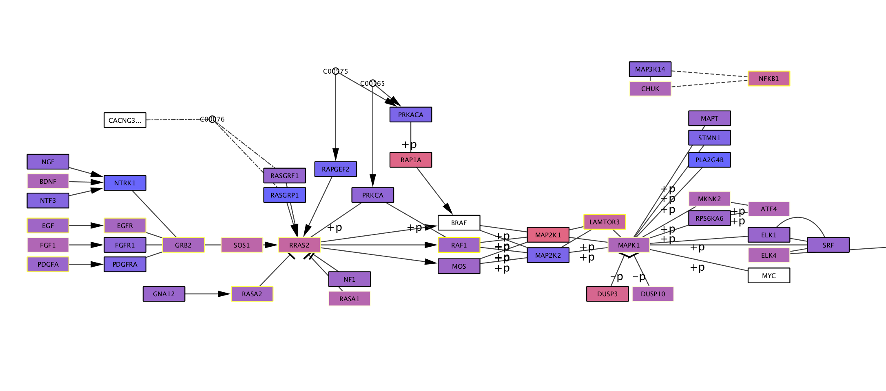

# Biological Networking 102 workshop
## Using CytoScape for bioinformatics


```
Peter Oxley, PhD
Associate Director of Research Services

Weill Cornell Medicine
Information Technologies and Services
Samuel J. Wood Library & C.V. Starr Biomedical Information Center
1300 York Avenue Room D-120
New York, NY 10065-4896
(P) 646-962-2576
(F) 212-746-8364
 
pro2004@med.cornell.edu
```


## Exercise A) Download MAPK pathway from KEGG
_if you want to be lazy, you can skip this exercise by just clicking [here](http://www.kegg.jp/kegg-bin/download?entry=hsa04010&format=kgml)_

1) go to KEGG.jp
2) search for MAPK in top searchbar
3) select the MAPK signaling pathway (map04010 - not the  pathways for yeast, plants and flies)
4) click on the pathway map 
5) select the "organism menu" option in the header
6) select "Homo sapiens"
7) select "download KGML" option in the header

## Exercise B) Install cyKEGGParser

8) open CytoScape
9) go to Apps > App manager 
10) search for cyKEGGParser
11) select app, then click install
12) click "close"

## Exercise C) Create classic MAPK pathway network

13) go to Apps > KEGGParser > Load KGML > Load local KGML
14) navigate to the saved MAPK KGML file from (B)
15) select the subnetwork (shift + click & drag) that corresponds to the MAPK classic pathway (refer to the KEGG.jp image for the label)
16) select File > New > Network > From selected nodes, all edges
17) right click / control click on the new network in the control panel on the left, and rename it to something informative




## Exercise D) Prepare Expression Data
_NB: This section can be skipped if you wish, and just use the GSE19143.txt file provided.
This section simply details how this file and its values were obtained._

18) go to the NCBI [GEO database](https://www.ncbi.nlm.nih.gov/gds) (ncbi.nlm.nih.gov/gds)
19) search for GSE19143
20) in the search results, find GSE19143, and select "Analyze with GEO2R"
21) select "define groups" near the top of the screen
22) add two groups: "sensitive" and "resistant"
23) assign all the PRED-sensitive samples (both adults and children) to the "sensitive" group, and all the PRED-resistant samples to the "resistant" group
24) scroll to the bottom and select "save all results"
25) select all results and paste into a text file
26) find and replace all quotation marks
27) save file as GSE19143.txt

## Exercise E) Upload expression data to CytoScape

28) select Import > Table > File...
29) navigate to saved expression file GSE19143.txt
30) choose "to an unassigned table" for where to import data
31) name the table GSE19143_data
32) click on the "Gene.symbol" header
33) select the "[ab]" (list of strings) data type
34) select the "other:" list delimiter and type "///" into the text box to its right
35) click outside the options box to close it
36) click "OK"

## Exercise F) Add expression data to pathway
_CytoScape v3.5.0 has incorporated a very useful "Map column" function, that allows conversion from one gene identifier to another. If you require more options/species/identifiers, install the BridgeDB app._

37) in the table panel, select "unassigned tables" on the the bottom tabs
38) select "+" (create new column) > New Single Column > String
39) label the column "first_gene"
40) select one of the empty cells in the new fist_gene column
41) select the "f(x)" (function builder) icon
42) select FIRST from the function list
43) select "Gene.symbol" from the "Next argument" drop-down, and click "Add"
44) select "entire column" from the "Apply to" field
45) click "OK"
46) right click / control click on the "first_gene" header, and select "Map column..."
47) select the following parameters:

```
Species:  "Homo sapiens"
Map from: "HGNC"
To:       "Ensembl"
select "Force single" (on)

click "OK"
```

48) a pop-up window should appear, displaying how many genes were successfully converted. Click "OK"
49) select the "NodeTable" tab at the bottom of the Table Panel
50) right click / control click on the "Label" header and select "Map column"
51) select the following parameters:

```
Species:  "Homo sapiens"
Map from: "HGNC"
To:       "Ensembl"
select    "Force single" (on)

click "OK"
```

52) dismiss the results pop-up window
53) select Tools > merge > Tables...
54) select the following options:

```
source table: GSE19143_data
select colunns: (select all)
key column to merge: Ensemble
type of merge: copy columns

Target
merge table to: a network collection
network collection: 80_MAPK signaling pathway
merge data in: Node table columns
key column for network: Ensemble
```

55) select "OK"
56) confirm that the node table for the MAPK classical network now includes all the columns from the GSE experiment.

## Exercise G) Color genes according to expression

57) select the style tab in the control panel (left window)
58) select fill color
59) change the column to "logFC"
60) change the mapping type to "continuous"
61) click on the "current mapping"
62) select "set min and max..."; change to -1 and 1.
63) select the downwards-pointing arrows above the color gradient; select "Node fill color"; choose your favorite colors
64) bonus task: change the border color to indicate the adjusted P value



## Exercise H) Export images

65) navigate to your desired network
66) use the style tab in the control panel, and the tool panel (view menu), to fine-tune the appearance of your network
67) select File > Export as image...
68) choose format, file path, and image parameters to suit
69) click "OK"
 
 