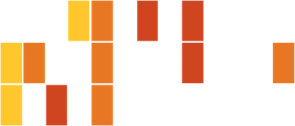

# Gene Ontology (GO) - understanding gene functions and relationships

Demonstration given by Peter Oxley, PhD
Monday, May 1st, 2017

## Contents:
1. [Presentation slides](./GO_demonstration_slides.pdf)
2. Article: "Expansion of the Gene Ontology knowledgebase and resources" The Gene Ontology Consortium (2017) [Nucleic Acids Research 45 (D1): D331-D338](https://academic.oup.com/nar/article/45/D1/D331/2605810/Expansion-of-the-Gene-Ontology-knowledgebase-and) __This article describes the latest updates to the Gene Ontology and Annotations.__
3. Article: "Ten Quick Tips for Using the Gene Ontology" Blake, J.A. (2013) [PLOS Computational Biology 9(11): e1003343](http://journals.plos.org/ploscompbiol/article?id=10.1371/journal.pcbi.1003343#s2)
4. Article: "Bioinformatics enrichment tools: paths toward the comprehensive functional analysis of large gene lists" Huang, D.W.; Sherman, B.T. and Lempicki,R.A. (2009) [Nucleic Acids Research 37 (1): 1-13](https://academic.oup.com/nar/article/37/1/1/1026684/Bioinformatics-enrichment-tools-paths-toward-the)
5. Tutorial on [using Cytoscape for Gene Ontology over-representation](../Cytoscape).
This tutorial was originally given for the Applied Bioinformatics Core d:bug sessions in April 2017. For more information on d:bug, see [here](https://github.com/abcdbug/dbug).

